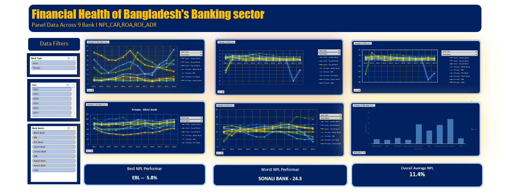

# Financial Health of Bangladesh's Banking Sector — Interactive Dashboard

An Excel-based interactive dashboard analyzing the financial soundness of 9 major Bangladeshi banks (State-Owned Commercial Banks and Private Commercial Banks) over a 12-year period (2012–2023).

<!-- Replace Screenshot 2026-08-24 224935.png with your actual screenshot file name -->

## 📌 Project Objective

Bangladesh's banking sector has long struggled with high Non-Performing Loan (NPL) ratios, especially among State-Owned Commercial Banks (SCBs) compared to Private Commercial Banks (PCBs). This project builds on themes explored in my M.S. thesis on macroeconomic determinants of NPL, translating panel-data analysis into an accessible, interactive visual tool for exploring bank-level financial health.

## 🏦 Banks Covered

Sonali Bank, Janata Bank, Rupali Bank (SCBs) · UCB, NBL, IFIC, BRAC Bank, EBL, Islami Bank (PCBs)

## 📊 Key Metrics

| Metric | Description |
|---|---|
| NPL Ratio (%) | Non-Performing Loan ratio — asset quality indicator |
| CAR (%) | Capital Adequacy Ratio — capital strength |
| ROA (%) | Return on Assets — profitability |
| ROE (%) | Return on Equity — profitability |
| AD Ratio (%) | Advance-Deposit Ratio — liquidity management |

## 🔍 Data Source

Bank-level financial data manually collected from individual bank annual reports (2012–2023).

## 🛠️ Methodology

- Data cleaning and structuring in Excel
- Pivot tables for bank-type (Govt vs Private) and year-wise aggregation
- Interactive slicers for Bank Type, Year, and Bank Name filtering
- Dynamic line and bar charts linked to pivot tables
- KPI summary cards (Best/Worst NPL performer, overall average)

## ✅ Key Findings

- **Best NPL performer:** EBL — 5.8%
- **Worst NPL performer:** Sonali Bank — 24.3%
- **Overall sector average NPL:** 11.4%
- Private Commercial Banks generally show stronger asset quality (lower NPL) compared to State-Owned Commercial Banks — consistent with structural patterns identified in my thesis research.

## 📁 Files

- `dashboard.xlsx` — source dashboard file (data, pivot tables, charts)
- `Screenshot 2026-08-24 224935.png` — static preview of the dashboard

## 🚀 Note

This is my first hands-on project building pivot tables and interactive dashboards in Excel, part of an ongoing progression toward data analytics and BI — with SQL currently in progress and Power BI planned next.

## 👤 Author

**Md. Mishel Mia**
M.S. in Statistics, University of Chittagong
[LinkedIn] · [GitHub]
